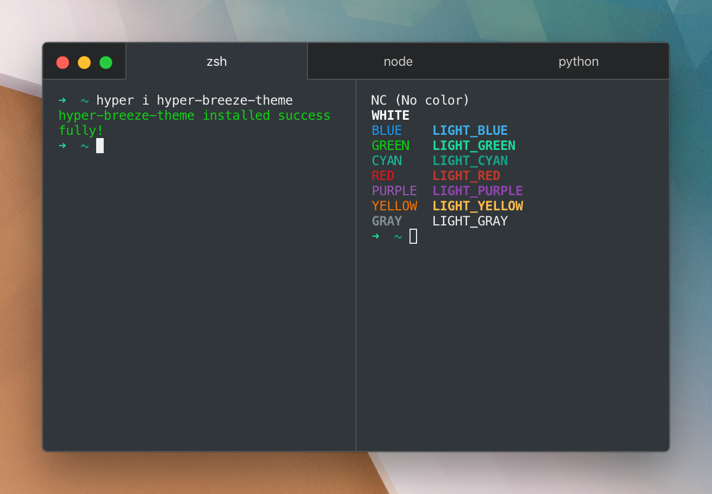

# hyper-breeze-theme

KDE Breeze-like theme for [Hyper](https://hyper.is).

## Installation

Installation can be simply done by doing steps below.

##### Inside Hyper

1. `hyper i hyper-breeze-theme`.

##### Manual

1. Edit `~/.hyper.js`.
2. Add `hyper-breeze-theme` to the `plugins` array.

## Contributing

This repository uses [pnpm](https://pnpm.js.org) which is recommended to be available before contributing, then:

1. Clone this repository in `~/.hyper-plugins/local` directory.
2. Add `hyper-breeze-theme` to `localPLugins` array in `~/.hyper.js`.
3. Run `pnpm install`.
4. Restart Hyper if needed.

## License

[MIT](LICENSE).
